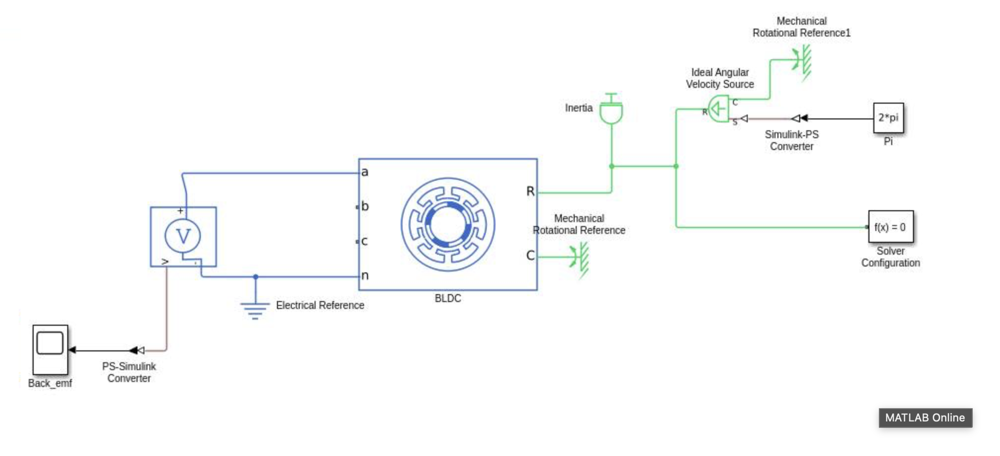

# Electric Vehicle & Hybrid Electric Vehicle (EV/HEV) MATLAB & Simulink Models

[](https://opensource.org/licenses/MIT)
[](https://www.mathworks.com/products/matlab.html)
[](https://lntedutech.com/)
[](https://smu.edu.in/smit.html)

<p align="center">
  
</p>

This repository contains MATLAB scripts and Simulink models developed and studied during the **Instructor-Led Training (ILT) sessions** delivered by **L&T EduTech**. 

These sessions were conducted at **Sikkim Manipal Institute of Technology (SMIT)**, jointly organized by the **Department of Electrical & Electronics Engineering (EEE)** and the **Department of Mechanical Engineering (ME)** as part of the **Minor Specialization in Electric Vehicles and Hybrid Electric Vehicles (EV/HEV)** in collaboration with **L&T EduTech**.

---

## 📋 Table of Contents

- [Overview](#overview)
- [Repository Structure](#repository-structure)
- [Models & Simulations](#models--simulations)
  - [1. EV Tractive Effort & Vehicle Dynamics](#1-ev-tractive-effort--vehicle-dynamics)
  - [2. BLDC Motor Drive Model](#2-bldc-motor-drive-model)
  - [3. Battery Current Source Demonstration Model](#3-battery-current-source-demonstration-model)
- [Governing Mathematical Equations](#governing-mathematical-equations)
- [Default Vehicle Parameters](#default-vehicle-parameters)
- [Prerequisites & Getting Started](#prerequisites--getting-started)
- [Academic & Industry Acknowledgments](#academic--industry-acknowledgments)
- [Author & License](#author--license)

---

## ⚡ Overview

The transition towards e-mobility requires multidisciplinary understanding bridging electrical machine drives, power electronics, and mechanical vehicle dynamics. This repository hosts simulation models focused on:
- Longitudinal vehicle dynamics and tractive force requirements.
- Sizing and power demand estimations for electric powertrains across variable drive speeds.
- Motor drive simulation for **Brushless DC (BLDC)** traction and EV energy storage modeling through a **Battery Current Source Demonstration** representing battery current and voltage delivery dynamics.

---

## 📁 Repository Structure

```text
EV-Matlab-Models/
├── .gitignore                       # Ignored files (.DS_Store, MATLAB autosaves, cache)
├── Battery_current_source_demonstration_Model.slx # Simulink model for Battery Current Source Demonstration
├── BLDC_Drive_Model.slx             # Simulink model for Brushless DC (BLDC) Motor Drive
├── EV_Tractive_Effort_Model.slx     # Simulink model for EV Tractive Effort analysis
├── Tractive_Effort_Simulation.m     # MATLAB script computing tractive forces & power vs speed
├── assets/
│   ├── Hero banner.png              # README header banner image
│   └── Screenshots/
│       ├── Aerodynamic Drag.png     # Aerodynamic drag vs speed plot
│       ├── Battery current source demonstration.png # Battery Current Source model architecture
│       ├── BLDC.png                 # BLDC Simulink model architecture
│       ├── BLDC Graph.png           # BLDC simulation scope waveforms
│       └── Rolling Resistance.png   # Tractive effort resistance components plot
├── LICENSE                          # MIT License
└── README.md                        # Project documentation
```

---

## 🚗 Models & Simulations

### 1. EV Tractive Effort & Vehicle Dynamics
- **Files**: [`Tractive_Effort_Simulation.m`](file:///Users/krishanand/EV-Matlab-Models/Tractive_Effort_Simulation.m), [`EV_Tractive_Effort_Model.slx`](file:///Users/krishanand/EV-Matlab-Models/EV_Tractive_Effort_Model.slx)
- **Description**: Evaluates the resistance forces opposing vehicle motion (rolling resistance, aerodynamic drag, grade resistance, and acceleration force) over a speed range of $0$ to $150 \text{ km/h}$. Computes total tractive effort and required motor mechanical power output.

#### Simulation Results & Visualizations:

<p align="center">
  
  <br>
  <em>Figure 1: Vehicle Tractive Effort components (Rolling Resistance, Aerodynamic Drag, Grade Resistance, Acceleration Force, Total Tractive Effort) vs. Speed</em>
</p>

<p align="center">
  
  <br>
  <em>Figure 2: Aerodynamic Drag Force vs. Vehicle Speed</em>
</p>

---

### 2. BLDC Motor Drive Model
- **File**: [`BLDC_Drive_Model.slx`](file:///Users/krishanand/EV-Matlab-Models/BLDC_Drive_Model.slx)
- **Description**: Implements a Brushless DC (BLDC) motor traction drive in Simulink. Features three-phase inverter switching, electronic commutation via Hall effect sensors, and speed/torque dynamic response characteristic of lightweight electric vehicles.

#### Simulink Model Architecture:
<p align="center">
  
  <br>
  <em>Figure 3: BLDC Motor Drive Simulink Schematic with Inverter, Hall Sensor Decoder, and Speed Controller</em>
</p>

#### Scope Waveforms & Response:
<p align="center">
  
  <br>
  <em>Figure 4: BLDC dynamic performance waveforms (Stator Current, Rotor Speed, Electromagnetic Torque)</em>
</p>

---

### 3. Battery Current Source Demonstration Model
- **File**: [`Battery_current_source_demonstration_Model.slx`](file:///Users/krishanand/EV-Matlab-Models/Battery_current_source_demonstration_Model.slx)
- **Description**: Demonstrates the simulation of an Electric Vehicle energy storage unit modeled as a controlled battery current source. Evaluates battery terminal behavior, current output dynamics, and electrical power delivery characteristics under varying load conditions in EV powertrain architectures.

#### Simulink Model Architecture:
<p align="center">
  
  <br>
  <em>Figure 5: Battery Current Source Demonstration Simulink Schematic</em>
</p>

---

## 📐 Governing Mathematical Equations

The total tractive effort ($F_{total}$) demanded by the vehicle to maintain acceleration and overcome resistive forces is given by:

$$F_{total} = F_{rr} + F_{d} + F_{grade} + F_{acc}$$

Where:

1. **Rolling Resistance Force ($F_{rr}$):**
   $$F_{rr} = C_{rr} \cdot m \cdot g \cdot \cos(\theta)$$

2. **Aerodynamic Drag Force ($F_{d}$):**
   $$F_{d} = \frac{1}{2} \cdot \rho \cdot C_d \cdot A \cdot v^2$$

3. **Grade Resistance Force ($F_{grade}$):**
   $$F_{grade} = m \cdot g \cdot \sin(\theta)$$

4. **Acceleration Inertia Force ($F_{acc}$):**
   $$F_{acc} = m \cdot a$$

5. **Motor Power Requirement ($P$):**
   $$P_{\text{kW}} = \frac{F_{total} \cdot v}{1000}$$

---

## 📊 Default Vehicle Parameters

The parameters configured in [`Tractive_Effort_Simulation.m`](file:///Users/krishanand/EV-Matlab-Models/Tractive_Effort_Simulation.m) are:

| Parameter | Symbol | Value | Unit |
| :--- | :---: | :---: | :---: |
| Vehicle Mass | $m$ | $1200$ | $\text{kg}$ |
| Acceleration due to Gravity | $g$ | $9.81$ | $\text{m/s}^2$ |
| Rolling Resistance Coefficient | $C_{rr}$ | $0.012$ | — |
| Air Density | $\rho$ | $1.225$ | $\text{kg/m}^3$ |
| Aerodynamic Drag Coefficient | $C_d$ | $0.29$ | — |
| Frontal Area | $A$ | $2.2$ | $\text{m}^2$ |
| Road Grade Angle | $\theta$ | $0$ | $\text{degrees}$ |
| Vehicle Acceleration | $a$ | $2.0$ | $\text{m/s}^2$ |
| Speed Range | $v$ | $0 - 150$ | $\text{km/h}$ |

---

## 🚀 Prerequisites & Getting Started

### Prerequisites
- **MATLAB** (R2021a or newer recommended)
- **Simulink**
- **Simscape / Simscape Electrical** (for motor drive and physical modeling blocks)
- **Powertrain Blockset** (optional, recommended)

### Running the Tractive Effort Script
1. Open MATLAB and set the current working directory to this repository.
2. Run the simulation script:
   ```matlab
   run('Tractive_Effort_Simulation.m')
   ```
3. View the console output table of speed vs. force/power and the three generated figure windows.

### Running Simulink Models
1. In the MATLAB command window, type:
   ```matlab
   open('EV_Tractive_Effort_Model.slx')
   ```
   or
   ```matlab
   open('BLDC_Drive_Model.slx')
   open('Battery_current_source_demonstration_Model.slx')
   ```
2. Click **Run** on the Simulink toolstrip to simulate the response over the designated time horizon.
3. Open the **Scope** blocks to observe torque, speed, and phase current waveforms.

---

## 🎓 Academic & Industry Acknowledgments

This work is part of the **Minor Specialization in Electric Vehicles and Hybrid Vehicles**:
- **Industry Partner**: **L&T EduTech** (Larsen & Toubro)
- **Institution**: **Sikkim Manipal Institute of Technology (SMIT)**, Sikkim Manipal University
- **Departments**: 
  - Department of Electrical & Electronics Engineering (**EEE**)
  - Department of Mechanical Engineering (**ME**)
- **Program**: Instructor-Led Training (ILT) Sessions on EV Modeling & Simulation

---

## 👤 Author & License

- **Author**: Krish Anand
- **License**: This project is licensed under the [MIT License](LICENSE).